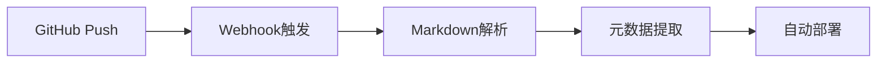
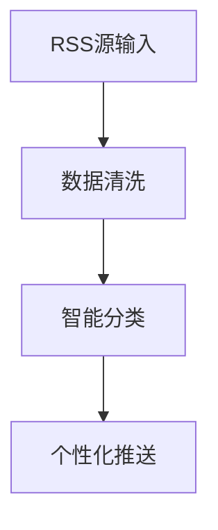

# 功能文档

## 模块深度解析

### 1. GitHub博客引擎



- Markdown元数据自动解析
- 提交事件驱动更新
- 自动化CI/CD流水线

### 2. RSS智能聚合器



### 3. API网关层

```json
{
  "route": "/v1/proxy",
  "target": "https://api.example.com",
  "rateLimit": "1000/分钟"
}
```

#### 核心功能

- 路由转发
- 限流控制
- 安全防护
- 监控告警